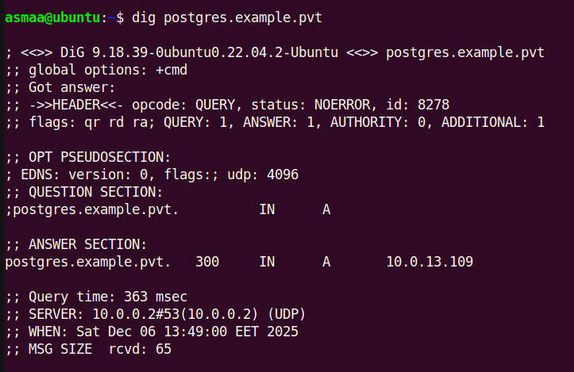
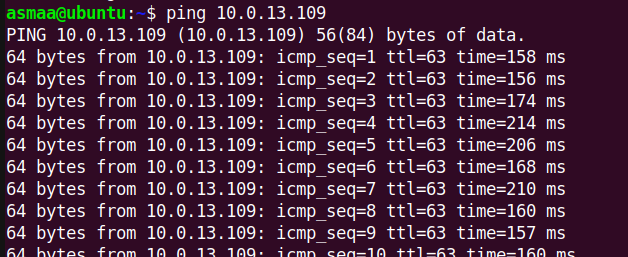
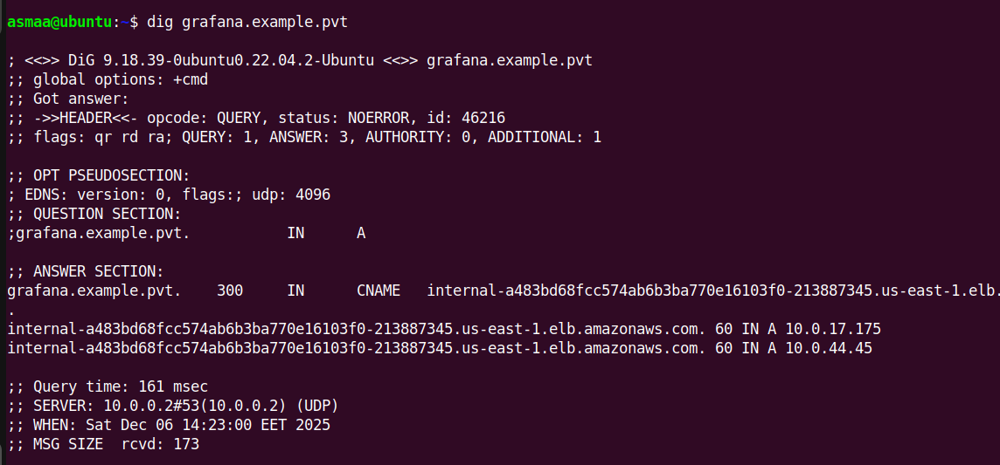

# Fully Private AWS EKS Cluster with OpenVPN Access

## Overview

This project demonstrates a **fully private Amazon EKS cluster** architecture with zero public endpoints. Access is provided exclusively through an OpenVPN bastion host, ensuring complete network isolation for production-grade security.

### Key Features

- Private EKS cluster with no public API endpoint
- OpenVPN bastion host for secure VPN-only access
- Private PostgreSQL EC2 instance for database workloads
- Route53 private hosted zone for internal DNS resolution
- Internal NGINX Ingress Controller with AWS internal load balancer
- Grafana monitoring accessible via private DNS (`grafana.example.pvt`)

---

## Architecture


### Architecture Components

| Component | Description |
|-----------|-------------|
| **OpenVPN EC2** | Bastion host in public subnet (t3.micro) with Elastic IP for VPN access |
| **Private EKS Cluster** | Kubernetes control plane with private endpoint only |
| **EKS Worker Nodes** | t3.large instances in private subnets |
| **PostgreSQL EC2** | Private database server (10.0.13.109) accessible via VPN |
| **Route53 Private Zone** | Internal DNS (`example.pvt`) for service discovery |
| **NGINX Ingress** | Internal load balancer for Kubernetes ingress |
| **Grafana** | Monitoring dashboard at `grafana.example.pvt` |

### Network Flow

```
Local Laptop (VPN Client)
       │
       ▼ (1) Connect to OpenVPN
OpenVPN EC2 (Public Subnet - 52.7.26.92:1194)
       │
       ▼ (2) Routes pushed: 10.0.0.0/19, 10.0.32.0/19
       │     DNS pushed: 10.0.0.2 (AWS VPC DNS)
       │
AWS VPC (10.0.0.0/16)
       │
       ├──► Private Subnet AZ1 (10.0.0.0/19)
       │    ├── EKS Worker Nodes
       │    └── PostgreSQL EC2 (10.0.13.109)
       │
       ├──► Private Subnet AZ2 (10.0.32.0/19)
       │    └── EKS Worker Nodes
       │
       ├──► EKS Control Plane (Private Endpoint Only)
       │
       └──► Route53 Private Hosted Zone (example.pvt)
            ├── postgres.example.pvt → 10.0.13.109
            └── grafana.example.pvt → Internal LB
```

---

## Screenshots


### DNS Resolution - PostgreSQL



Resolving `postgres.example.pvt` returns the private IP `10.0.13.109`.

### Internal Load Balancer Resolution


The internal NGINX ingress load balancer resolves to private IPs (10.0.44.45, 10.0.17.175).

### Connectivity Test - PostgreSQL



Successful ICMP ping to PostgreSQL private IP from VPN client.

---

## Prerequisites

- AWS CLI configured with appropriate credentials
- Terraform >= 1.0
- kubectl
- OpenVPN client
- AWS account with permissions for VPC, EKS, EC2, IAM, Route53

---

## Infrastructure Configuration

### Network Configuration (terraform/0-locals.tf)

| Parameter | Value |
|-----------|-------|
| Environment | dev |
| Region | us-east-1 |
| VPC CIDR | 10.0.0.0/16 |
| Private Subnet AZ1 | 10.0.0.0/19 |
| Private Subnet AZ2 | 10.0.32.0/19 |
| Public Subnet AZ1 | 10.0.64.0/19 |
| Public Subnet AZ2 | 10.0.96.0/19 |
| EKS Cluster Name | dev-main |
| EKS Version | 1.34 |

### EKS Configuration

```hcl
# Private endpoint ONLY - no public access
endpoint_private_access = true
endpoint_public_access  = false

# Node Group
instance_types = ["t3.large"]
capacity_type  = "ON_DEMAND"
desired_size   = 1
min_size       = 0
max_size       = 10
```

### Helm Deployments

| Application | Version | Namespace | Access |
|-------------|---------|-----------|--------|
| NGINX Ingress | 4.13.3 | ingress | Internal LB |
| Grafana | 10.1.1 | monitoring | grafana.example.pvt |

---

## Deployment

### 1. Deploy Infrastructure

```bash
cd terraform
terraform init
terraform plan
terraform apply
```

### 2. Configure OpenVPN Server

SSH into the OpenVPN EC2 instance and run:

```bash
# Install OpenVPN and EasyRSA
sudo apt-get update && sudo apt-get -y upgrade
curl -fsSL https://swupdate.openvpn.net/repos/repo-public.gpg | sudo gpg --dearmor -o /etc/apt/keyrings/openvpn.gpg
echo "deb [signed-by=/etc/apt/keyrings/openvpn.gpg] http://build.openvpn.net/debian/openvpn/stable $(lsb_release -cs) main" | sudo tee /etc/apt/sources.list.d/openvpn.list
sudo apt-get update
sudo apt-get install -y openvpn

# Install EasyRSA
wget https://github.com/OpenVPN/easy-rsa/releases/download/v3.2.4/EasyRSA-3.2.4.tgz
tar -zxf EasyRSA-3.2.4.tgz
sudo mv EasyRSA-3.2.4/ /etc/openvpn/easy-rsa
sudo ln -s /etc/openvpn/easy-rsa/easyrsa /usr/local/bin/

# Initialize PKI and generate certificates
cd /etc/openvpn/easy-rsa
easyrsa init-pki
easyrsa build-ca nopass
easyrsa gen-req openvpn-server nopass
easyrsa sign-req server openvpn-server
openvpn --genkey secret ta.key

# Enable IP forwarding
echo 'net.ipv4.ip_forward=1' | sudo tee -a /etc/sysctl.conf
sudo sysctl -p

# Configure NAT
sudo iptables -t nat -I POSTROUTING -s 10.8.0.0/24 -o ens5 -j MASQUERADE
sudo apt-get install -y iptables-persistent

# Start OpenVPN
sudo systemctl start openvpn-server@server
sudo systemctl enable openvpn-server@server
```

### 3. Generate Client Certificate

```bash
cd /etc/openvpn/easy-rsa
easyrsa gen-req client-1 nopass
easyrsa sign-req client client-1
```

### 4. Create Client Configuration

Create `.ovpn` file with:
- CA certificate (`pki/ca.crt`)
- Client certificate (`pki/issued/client-1.crt`)
- Client key (`pki/private/client-1.key`)
- TLS auth key (`ta.key`)

See `example-1.ovpn` for reference.

### 5. Connect and Configure kubectl

```bash
# Connect to VPN
sudo openvpn --config client.ovpn

# Update kubeconfig (from VPN-connected machine)
aws eks update-kubeconfig --name dev-main --region us-east-1

# Verify access
kubectl get nodes
```

---

### Verify Private Endpoint

```bash
aws eks describe-cluster --name dev-main \
  --query 'cluster.resourcesVpcConfig.{Public:endpointPublicAccess,Private:endpointPrivateAccess}'
# Expected: { "Public": false, "Private": true }
```

## Verification.

### Test DNS Resolution

```bash

# Grafana DNS
dig grafana.example.pvt
# Expected: CNAME to internal-*.elb.amazonaws.com

```
### DNS Resolution - Grafana



Resolving `grafana.example.pvt` returns a CNAME to the internal load balancer.

### Test Connectivity

```bash
# Ping PostgreSQL
ping 10.0.13.109

# Access Grafana (from browser while connected to VPN)
# URL: http://grafana.example.pvt
# Username: admin
# Password: devops123
```


---

## Security Features

| Feature | Implementation |
|---------|----------------|
| Zero Public Endpoints | EKS API private only |
| VPN-Only Access | OpenVPN bastion with certificate auth |
| Private Subnets | All compute in isolated subnets |
| Security Group Isolation | Explicit ingress rules between components |
| Private DNS | Route53 private hosted zone |
| Internal Load Balancer | NGINX ingress uses AWS internal ALB |
| Encryption | AES-256-GCM cipher, SHA256 auth |

---

## File Structure

```
private-access-eks/
├── README.md
├── terraform/
│   ├── 0-locals.tf          # Environment variables
│   ├── 1-providers.tf       # AWS provider config
│   ├── 2-vpc.tf             # VPC and networking
│   ├── 3-openvpn-sg.tf      # OpenVPN security group
│   ├── 4-openvpn-ec2.tf     # OpenVPN EC2 instance
│   ├── 5-postgres-sg.tf     # PostgreSQL security group
│   ├── 6-postgres-ec2.tf    # PostgreSQL EC2 instance
│   ├── 7-route53.tf         # Private hosted zone
│   ├── 8-example-dns.tf     # DNS records
│   ├── 9-eks.tf             # EKS cluster
│   ├── 10-eks-sg.tf         # EKS security rules
│   ├── 11-eks-nodes.tf      # EKS node group
│   ├── 12-nginx-ingress.tf  # NGINX Helm release
│   ├── 13-grafana.tf        # Grafana Helm release
│   └── values/
│       ├── nginx-ingress.yaml
│       └── grafana.yaml
├── server.conf              # OpenVPN server config
├── example-1.ovpn           # Sample client config
├── vars                     # EasyRSA variables
├── delete-vpc.sh            # Cleanup script
└── Screenshots/
    ├── unnamed.jpg          # Architecture diagram
    ├── grafana.png          # Grafana DNS resolution
    ├── postgres.png         # PostgreSQL DNS resolution
    ├── ping.png             # Connectivity test
    └── Screenshot from 2025-12-06 14-20-24.png
```

---

## Cleanup

### Using Terraform

```bash
cd terraform
terraform destroy
```

### Manual Cleanup (if needed)

Use the provided cleanup script:

```bash
./delete-vpc.sh
```

This script removes resources in the correct dependency order:
1. NAT Gateways
2. EC2 Instances
3. Load Balancers
4. Elastic IPs
5. VPC Endpoints
6. Security Groups
7. Network Interfaces
8. Internet Gateways
9. Subnets
10. Route Tables
11. VPC

---

## Why Fully Private?

1. **Enhanced Security** - No public endpoints eliminate external attack surface
2. **Compliance** - Meets PCI-DSS, HIPAA, and SOC2 requirements
3. **Data Sovereignty** - All traffic remains within AWS network
4. **Network Isolation** - Complete control over network boundaries
5. **Audit Trail** - All access through VPN provides clear audit logging
